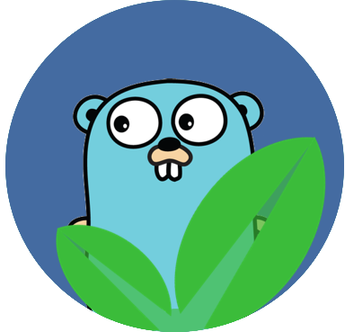

<p align="center">
  
  <h3 align="center">fnple</h3>
  <p align="center">The simple fintech platform for people</p>
</p>
<a name="readme-top"></a>

---

## Overview

**`fnple`** is a simple, configurable, fintech platform.

## Status

Currently experimenting with

- Project structures
- Ways to pass application context i.e. db connection etc
- Ways to implement middleware

## To start using `fnple`

Head over to [fnple.isnotregisteryet.ohmy](http://mybad)

## To start contributing to `fnple`

### Prerequisites

- You have a working [Go environment](https://go.dev/doc/install)
- You have a working [Docker](https://docs.docker.com/engine) environment, we use [Podman](https://podman.io)

  ```sh
  alias docker="podman"
  ```

### Getting Started

1. Ensure you have all the prerequisites setup
2. Clone the repo

    ```sh
    git clone git@github.com:brettmostert/fnple-go.git
    ```

3. Execute the `bootstrap.sh` script, this will install a few tools, namely: bob, gfumpt, tern, commitlint, markdownlint, husky.

   ```sh
   ./scripts/bootstrap.sh
   ```

4. **Optional**. Setup your IDE by following the instructions at
    - <https://github.com/mvdan/gofumpt>
    - <https://golangci-lint.run/usage/integrations>

## Project Setup

Below is a brief description of how this project is setup.

### BootStrap

The tools listed below are required for the build and/or packaging process.

| Category | Description                        | URL                       |
| -------- | ---------------------------------- | ------------------------- |
| Linter   | `golangci` is our linter of choice | <https://golangci-lint.run> |
| Formatter| `gofumpt` replaces gofmt           | <https://github.com/mvdan/gofumpt> |
